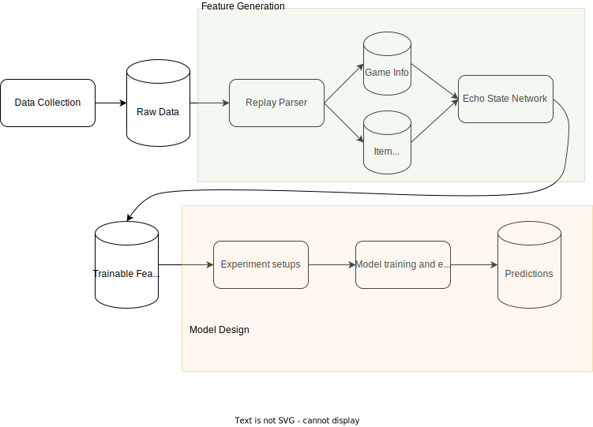
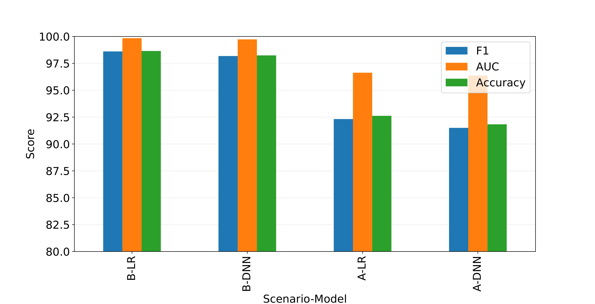

# player_identifier_Dota2
Player authentication in Dota 2 based on Itemization and Mouse Movement<br/>

## Project explanation
The pipeline consists of the following parts

<ol>
  <li>Replay Collector: We scrape <a href="https://www.dotabuff.com/">Dotabuff</a> to collect list of viable Steam ID and collect the replays using <a href="https://www.opendota.com/">OpenDota</a></li>
  <li>Replay Parser: Java code that uses <a href="https://github.com/skadistats/clarity">Clarity</a> to parse replays</li>
  <li>Create Itemization data and apply <a href="https://en.wikipedia.org/wiki/Echo_state_network">Echo State Network</a> to achieve fixed dimension data.</li>
  <li>Model Training: Train model using Logistic Regression and Deep Neural Network (<a href="https://keras.io/">Keras</a>)</li>
  <li>Model Evaluation by Accuracy, F1-Score and Area Under Curve of ROC</li>
</ol>


## Result

We got over 90% F1-Score for binary classification of two accounts in both case of playing different heros or the same hero

*Scenario B is different heroes while Scenario A is for Same Hero*

## Running
You can see final/<br/>
Using Python(Make sure you are using python 3.8 or above):
    ```
    pip install -r requirements.txt  
    python app.py  
    ```

## Author
* **Saleh Daghigh** - [ucontacti](https://github.com/ucontacti)

This project was done under the supervision of Dr. Rafet Sifa from Fraunhofer Institute.